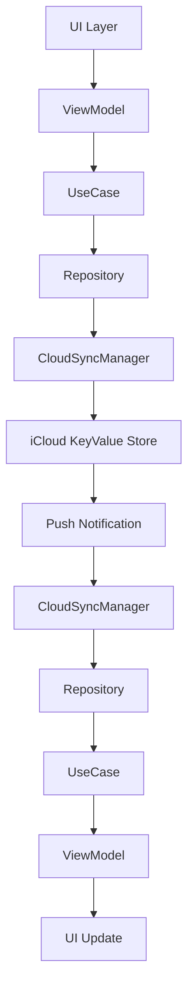

# Nower 프로젝트 아키텍처 문서

## 📋 개요

Nower는 MacOS와 iOS를 위한 크로스 플랫폼 캘린더 앱으로, Clean Architecture 패턴을 적용하여 개발되었습니다. 두 플랫폼 간 데이터 동기화를 위해 iCloud를 사용하며, 공통 데이터 모델과 동기화 로직을 공유합니다.

## 🏗️ 프로젝트 구조

```
Nower/
├── Nower/                           # 🖥️ MacOS 프로젝트
│   └── Nower/
│       ├── Domain/                  # 비즈니스 로직 계층
│       │   ├── Repository/
│       │   │   └── TodoRepository.swift
│       │   └── UseCase/
│       │       └── TodoUseCase.swift
│       ├── Data/                    # 데이터 계층
│       │   ├── RepositoryImpl/
│       │   │   └── TodoRepositoryImpl.swift
│       │   └── UseCaseImpl/
│       │       └── TodoUseCaseImpl.swift
│       ├── View/                    # 프레젠테이션 계층
│       │   ├── View/
│       │   │   ├── ContentView.swift
│       │   │   ├── CalendarGridView.swift
│       │   │   └── AddEventView.swift
│       │   └── ViewModel/
│       │       └── CalendarViewModel.swift
│       ├── Extension/
│           ├── AppColors.swift
│           └── AppIcons.swift
│       └── Shared/                  # 📦 MacOS 공통 모듈
│           ├── Domain/
│           │   └── Entity/
│           │       ├── TodoItem.swift       # 공통 Todo 데이터 모델
│           │       └── CalendarDay.swift    # 공통 달력 데이터 모델
│           └── Data/
│               └── Repository/
│                   └── CloudSyncManager.swift # 공통 iCloud 동기화 매니저
│
└── Nower-iOS/                       # 📱 iOS 프로젝트
    └── Nower-iOS/
        ├── Domain/                  # 비즈니스 로직 계층
        │   ├── Entity/
        │   │   ├── Todo.swift       # ⚠️ DEPRECATED
        │   │   ├── CalendarDay.swift # ⚠️ DEPRECATED
        │   │   └── Holiday.swift
        │   ├── Repository/
        │   │   ├── TodoRepository.swift
        │   │   └── HolidayRepository.swift
        │   └── UseCase/
        │       ├── TodoUseCase.swift
        │       └── HolidayUseCase.swift
        ├── Data/                    # 데이터 계층
        │   ├── RepositoryImpl/
        │   │   ├── TodoRepositoryImpl.swift
        │   │   └── HolidayRepositoryImpl.swift
        │   ├── UseCaseImpl/
        │   │   ├── TodoUseCaseImpl.swift
        │   │   └── HolidayUseCaseImpl.swift
        │   └── Source/
        │       └── Remote/
        │           ├── HolidayAPIClient.swift
        │           └── HolidayService.swift
        └── Presentation/            # 프레젠테이션 계층
            ├── Calendar/
            │   ├── View/
            │   │   ├── CalendarView.swift
            │   │   └── Cell/
            │   ├── ViewController/
            │   │   ├── CalendarViewController.swift
            │   │   └── NewEventViewController.swift
            │   └── ViewModel/
            │       └── CalendarViewModel.swift
            └── Toast/
                └── View/
                    └── ToastView.swift
        └── Shared/                  # 📦 iOS 공통 모듈
            ├── Domain/
            │   └── Entity/
            │       ├── TodoItem.swift       # 공통 Todo 데이터 모델
            │       └── CalendarDay.swift    # 공통 달력 데이터 모델
            └── Data/
                └── Repository/
                    └── CloudSyncManager.swift # 공통 iCloud 동기화 매니저
```

## 🎯 Clean Architecture 적용

### Domain Layer (비즈니스 로직)
- **Entity**: 핵심 비즈니스 데이터 모델 (`TodoItem`, `CalendarDay`)
- **Repository Protocol**: 데이터 액세스 추상화
- **UseCase Protocol**: 비즈니스 로직 추상화

### Data Layer (데이터 관리)
- **Repository Implementation**: 실제 데이터 소스 접근
- **UseCase Implementation**: 비즈니스 로직 구현
- **CloudSyncManager**: iCloud 동기화 로직

### Presentation Layer (UI)
- **View/ViewController**: UI 컴포넌트
- **ViewModel**: UI 상태 관리 및 비즈니스 로직 연결

## 🔄 데이터 흐름



## 📱 플랫폼별 특징

### MacOS (Nower)
- **SwiftUI 기반**: 선언적 UI 프레임워크
- **NSApplication**: 앱 라이프사이클 관리
- **Status Bar Integration**: 시스템 트레이 연동
- **Window Management**: 창 위치 기억 기능

### iOS (Nower-iOS)
- **UIKit 기반**: 명령형 UI 프레임워크
- **UIViewController**: 화면 전환 관리
- **Holiday API**: 공휴일 정보 연동
- **Collection View**: 달력 그리드 구현

## ☁️ iCloud 동기화

### CloudSyncManager
- **Thread-Safe**: 동시성 처리를 위한 DispatchQueue 사용
- **Automatic Sync**: 자동 변경 감지 및 동기화
- **Conflict Resolution**: 중복 데이터 방지 로직
- **Error Handling**: 네트워크 오류 및 데이터 손실 방지

### 동기화 과정
1. 로컬 변경사항 발생
2. CloudSyncManager에 전달
3. iCloud KeyValue Store에 저장
4. 다른 기기에서 변경사항 감지
5. 자동 알림 발송 및 UI 업데이트

## 🎨 디자인 시스템

### 색상 관리
- **AppColors.swift**: 공통 색상 정의
- **Platform Adaptation**: MacOS/iOS 각각 최적화
- **Theme Support**: 다크모드 대응

### 컴포넌트 재사용
- **TodoItem**: 일정 항목 표시
- **CalendarCell**: 달력 셀 구현
- **Toast**: 알림 메시지

## 🔧 확장성 고려사항

### 새로운 플랫폼 추가
1. Shared 모듈 재사용
2. 플랫폼별 Presentation Layer 구현
3. CloudSyncManager 연동

### 새로운 기능 추가
1. Domain Layer에 UseCase 추가
2. Data Layer에 Repository 구현
3. Presentation Layer에 UI 구현

## 📈 성능 최적화

### 메모리 관리
- **Weak References**: 순환 참조 방지
- **Lazy Loading**: 필요한 시점에 리소스 로드
- **Cache Strategy**: 중복 데이터 로드 방지

### 동기화 최적화
- **Batch Operations**: 여러 변경사항을 묶어서 처리
- **Delta Sync**: 변경된 부분만 동기화
- **Background Processing**: 백그라운드에서 동기화 수행

## ⚠️ 주의사항

### Deprecated Files
다음 파일들은 더 이상 사용하지 않으며, Shared 모듈로 대체되었습니다:
- `Nower/Network/DTO/CalendarDay.swift`
- `Nower-iOS/Domain/Entity/Todo.swift`
- `Nower-iOS/Domain/Entity/CalendarDay.swift`
- `Nower/Data/EventManager.swift`

### Migration Guide
기존 코드를 새로운 아키텍처로 마이그레이션할 때:
1. Shared 모듈의 엔티티 사용
2. CloudSyncManager를 통한 데이터 접근
3. UseCase 패턴으로 비즈니스 로직 분리

## 🧪 테스트 전략

### Unit Tests
- **UseCase Testing**: 비즈니스 로직 검증
- **Repository Testing**: 데이터 액세스 로직 검증
- **Mock Objects**: 의존성 주입을 통한 테스트 격리

### Integration Tests
- **iCloud Sync Testing**: 동기화 로직 검증
- **Cross-Platform Testing**: 플랫폼 간 데이터 일관성 검증

## 📚 참고 자료

- [Clean Architecture by Robert C. Martin](https://blog.cleancoder.com/uncle-bob/2012/08/13/the-clean-architecture.html)
- [Apple iCloud Design Guide](https://developer.apple.com/icloud/)
- [SwiftUI Documentation](https://developer.apple.com/documentation/swiftui/)
- [UIKit Documentation](https://developer.apple.com/documentation/uikit/)
