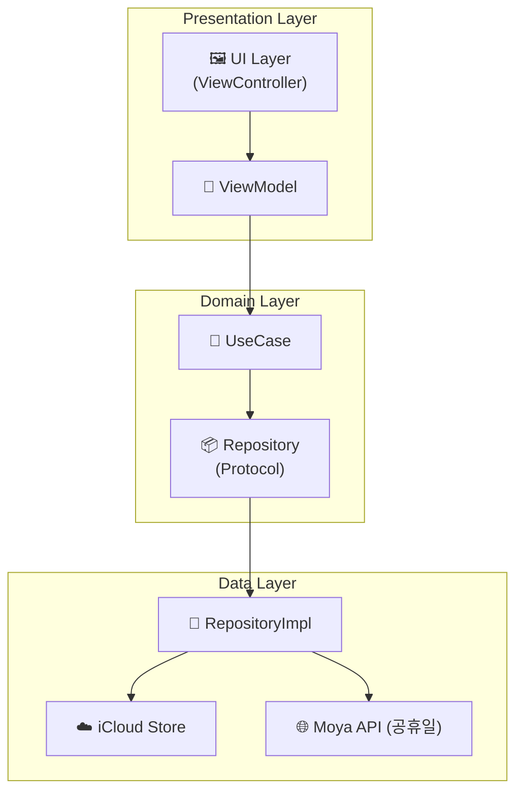

<h1>📂 Nower iOS & macOS App</h1>

<h2>📌 소개</h2>

  <strong>Nower</strong>는 <code>iCloud</code> 기반의 Todo 및 캘린더 앱으로, 
  <strong>Clean Architecture</strong>에 따라 Presentation, Domain, Data 레이어가 분리되어 유지보수성과 테스트가 용이하게 설계된 <code>macOS SwiftUI</code>, <code>iOS UIKit</code> 앱입니다.

<h2>📐 아키텍처 구조</h2>

<h2>🧠 Clean Architecture 흐름</h2>

<pre>
[ UI Layer (UIKit) ]
      ⬇️
[ ViewController ] -- binds --> [ ViewModel ]
      ⬇️                               ⬇️
 Presentation Layer         Domain Layer
                            (UseCases)
                                   ⬇️
                        Domain → Repository Protocol
                                   ⬇️
                           Data Layer (Impl)
                           iCloud / API(Moya)
</pre>

<h2>🔩 주요 의존성 주입 (DI)</h2>

<pre><code>SceneDelegate.swift

let repository = TodoRepositoryImpl()
let holidayRepository = HolidayRepositoryImpl()
let holidayUseCase = DefaultFetchHolidayUseCase(repository: holidayRepository)

let viewModel = CalendarViewModel(
    addTodoUseCase: DefaultAddTodoUseCase(repository: repository),
    deleteTodoUseCase: DefaultDeleteTodoUseCase(repository: repository),
    updateTodoUseCase: DefaultUpdateTodoUseCase(repository: repository),
    getTodosByDateUseCase: DefaultGetTodosByDateUseCase(repository: repository),
    loadAllTodosUseCase: DefaultLoadAllTodosUseCase(repository: repository),
    holidayUseCase: holidayUseCase
)

let coordinator = AppCoordinator(window: window, viewModel: viewModel)
coordinator.start()
</code></pre>

<h2>☁️ iCloud 저장 방식</h2>
<ul>
  <li><strong>저장 키:</strong> <code>"SavedTodos"</code></li>
  <li><strong>형식:</strong> <code>[Data]</code> 배열 형태로 <code>TodoItem</code> 각각을 JSON 인코딩</li>
  <li><strong>변경 감지:</strong> <code>NSUbiquitousKeyValueStore.didChangeExternallyNotification</code></li>
</ul>

<pre><code>
NotificationCenter.default.addObserver(
    self,
    selector: #selector(handleiCloudUpdate),
    name: NSUbiquitousKeyValueStore.didChangeExternallyNotification,
    object: store
)
</code></pre>

<h2>📦 공휴일 API (Moya)</h2>
<pre><code>
provider.request(.getHolidays(year: 2025, month: 5)) { result in ... }
</code></pre>

<ul>
  <li>공휴일 정보는 <code>HolidayUseCase</code>를 통해 ViewModel로 전달</li>
  <li>날짜별 공휴일은 <code>yyyy-MM-dd</code> 문자열 키로 매핑</li>
</ul>

<h2>📱 UI 기능 요약</h2>

<table border="1" cellpadding="6">
  <tr><th>기능</th><th>설명</th></tr>
  <tr><td>캘린더 뷰</td><td>월간 달력 렌더링, 공휴일/일정 표시</td></tr>
  <tr><td>할 일 추가</td><td>하프 모달 UI로 <code>NewEventViewController</code> 활용</td></tr>
  <tr><td>할 일 삭제/수정</td><td><code>EventPopupViewController</code>에서 처리</td></tr>
  <tr><td>Toast 알림</td><td><code>ToastView</code>를 통한 일정 완료 알림</td></tr>
</table>

<h2>🧪 디버깅 팁</h2>
<ul>
  <li><code>store.dictionaryRepresentation</code>로 iCloud 전체 상태 출력 가능</li>
  <li><code>loadFromiCloud()</code> 및 <code>saveToiCloud()</code> 내부에 디버그 로그 삽입 완료</li>
</ul>

<h2>📋 릴리즈 관리</h2>

  Nower 프로젝트는 <strong>Semantic Versioning</strong>과 <strong>Conventional Commits</strong>를 따릅니다.

<h3>버전 히스토리</h3>
<ul>
  <li><strong>v0.1.0</strong> (2026-02-08): 첫 번째 베타 릴리즈</li>
</ul>

<h3>문서</h3>
<ul>
  <li><a href="CHANGELOG.md">CHANGELOG.md</a> - 전체 변경 이력</li>
  <li><a href="RELEASE_GUIDE.md">RELEASE_GUIDE.md</a> - 릴리즈 프로세스 가이드</li>
  <li><a href="https://github.com/JJongW/Nower/releases">Releases</a> - GitHub 릴리즈 페이지</li>
</ul>

<h3>기여하기</h3>

  프로젝트에 기여하고 싶으신가요? PR을 환영합니다!

<ol>
  <li>이 저장소를 Fork합니다</li>
  <li>Feature 브랜치를 생성합니다 (<code>git checkout -b feature/amazing-feature</code>)</li>
  <li>변경사항을 커밋합니다 (<code>git commit -m 'feat: add amazing feature'</code>)</li>
  <li>브랜치에 Push합니다 (<code>git push origin feature/amazing-feature</code>)</li>
  <li>Pull Request를 생성합니다</li>
</ol>

  자세한 내용은 <a href="RELEASE_GUIDE.md">RELEASE_GUIDE.md</a>를 참고하세요.

<h2>🔄 향후 계획</h2>

<ul>
  <li>✅ 다크모드 대응</li>
  <li>✅ 공휴일 및 반복 일정 처리</li>
  <li>✅ 체계적인 릴리즈 관리 시스템</li>
  <li>🔄 CI/CD 자동화</li>
  <li>❌ SwiftUI 마이그레이션 (예정 없음)</li>
  <li>❌ Realm 등의 로컬 DB 연동 (추후 논의)</li>
</ul>
